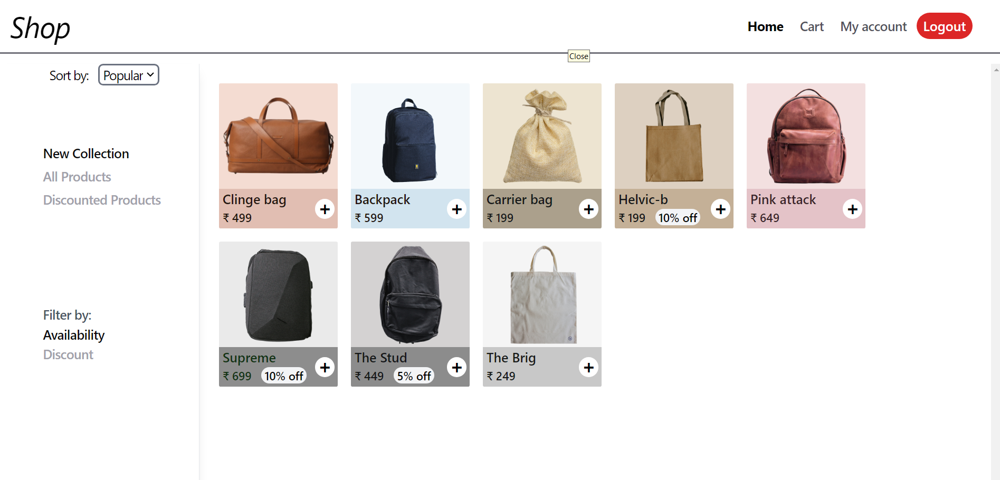

<h1>Bag Shop</h1>

<h2>Overview</h2>

The Bag Shop project is a full-stack web application that allows users to browse, filter, and purchase a variety of bags. Built using the MERN stack (MongoDB, Express.js, React, Node.js), this application aims to provide a seamless shopping experience with user-friendly navigation and an intuitive interface.

<h2>Features</h2>
<ul>
    <li><strong>User Authentication:</strong> Secure user registration and login using JWT for session management.</li>
    <li><strong>Product Catalog:</strong> Display a diverse range of bags with detailed descriptions and images.</li>
    <li><strong>Shopping Cart:</strong> Users can add products to their cart and view the total price before checkout.</li>
    <li><strong>Responsive Design:</strong> The application is fully responsive, ensuring a great experience on both desktop and mobile devices.</li>
    <li><strong>Filter and Search:</strong> Users can easily search for bags or filter by categories to find their desired products.</li>
</ul>

<h2>Technologies Used</h2>
<ul>
    <li><strong>Frontend:</strong> ejs, TailwindCSS</li>
    <li><strong>Backend:</strong> Node.js, Express.js</li>
    <li><strong>Database:</strong> MongoDB</li>
    <li><strong>Authentication:</strong> JSON Web Tokens (JWT)</li>
</ul>

<h2>Getting Started</h2>

To get started with the project, follow these steps:

<ol>
    <li>Clone the repository:
        <pre><code>git clone https://github.com/yourusername/bag-shop.git</code></pre>
    </li>
    <li>Navigate to the project directory:
        <pre><code>cd bag-shop</code></pre>
    </li>
    <li>Install the dependencies:
        <pre><code>npm install</code></pre>
    </li>
    <li>Create a <code>.env</code> file in the root directory and set your environment variables, including <code>JWT_KEY</code>.</li>
    <li>Start the server:
        <pre><code>npm run start</code></pre>
    </li>
    <li>Open your browser and visit <a href="http://localhost:3000">http://localhost:3000</a> to view the application.</li>
</ol>

<h2>Contributing</h2>

Contributions are welcome! If you'd like to contribute, please fork the repository and submit a pull request.

<h2>License</h2>

This project is licensed under the MIT License - see the LICENSE file for details.

##Overview : 

